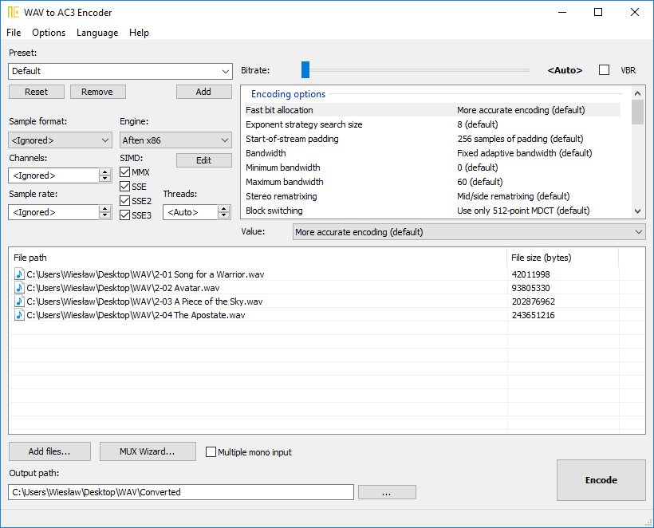
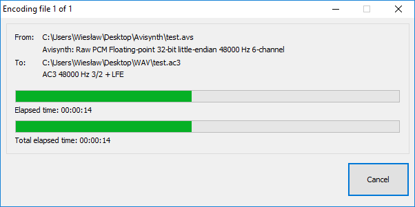
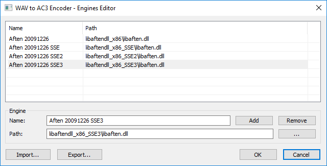
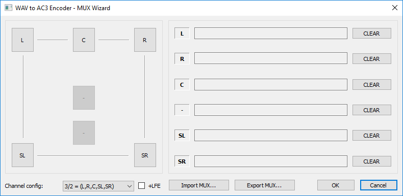

# WAV to AC3 Encoder

[](https://gitter.im/wieslawsoltes/wavtoac3encoder?utm_source=badge&utm_medium=badge&utm_campaign=pr-badge)

[](https://ci.appveyor.com/project/wieslawsoltes/wavtoac3encoder/branch/master)

[](https://github.com/wieslawsoltes/wavtoac3encoder)
[](https://github.com/wieslawsoltes/wavtoac3encoder)
[](https://github.com/wieslawsoltes/wavtoac3encoder)

WAV to AC3 Encoder an audio encoder which generates compressed audio streams based on [ATSC A/52 specification](https://en.wikipedia.org/wiki/Dolby_Digital).

## Support WAV to AC3 Encoder

[](https://www.paypal.com/cgi-bin/webscr?cmd=_s-xclick&hosted_button_id=GFQMG36HPYT6W)

## Download WAV to AC3 Encoder

| Platforn              | Type        | Version       | Download                                                                                                                               |
|-----------------------|-------------|---------------|----------------------------------------------------------------------------------------------------------------------------------------|
| Windows 32-bit        | Installer   | 7.0           | [EncWAVtoAC3-7.0-Win32.exe](https://github.com/wieslawsoltes/wavtoac3encoder/releases/download/7.0/EncWAVtoAC3-7.0-Win32.exe)          |
| Windows 64-bit        | Installer   | 7.0           | [EncWAVtoAC3-7.0-x64.exe](https://github.com/wieslawsoltes/wavtoac3encoder/releases/download/7.0/EncWAVtoAC3-7.0-x64.exe)              |
| Windows 32-bit        | Portable    | 7.0           | [EncWAVtoAC3-7.0-Win32.zip](https://github.com/wieslawsoltes/wavtoac3encoder/releases/download/7.0/EncWAVtoAC3-7.0-Win32.zip)          |
| Windows 64-bit        | Portable    | 7.0           | [EncWAVtoAC3-7.0-x64.zip](https://github.com/wieslawsoltes/wavtoac3encoder/releases/download/7.0/EncWAVtoAC3-7.0-x64.zip)              |

## System requirements

Minimum supported Windows version is Windows 7 SP1 or above, recommended is Windows 10 Anniversary Update.

Provided binaries should work under Windows XP Service Pack 3 (SP3) for x86, Windows XP Service Pack 2 (SP2) for x64.

Minimum supported Linux version is Ubutnu 16.10 (using Wine 2.0).

## CI Builds

[Download](https://ci.appveyor.com/project/wieslawsoltes/wavtoac3encoder/build/artifacts) bleeding edge builds from the CI server.

## Mirrors

[](http://www.softpedia.com/get/Multimedia/Audio/Audio-CD-Rippers-Encoders/WAV-to-AC3-Encoder.shtml)

## About

WAV to AC3 Encoder is an audio encoder which generates compressed 
audio streams based on [ATSC A/52 specification](https://en.wikipedia.org/wiki/Dolby_Digital) specification. This type of audio 
is also known as AC-3 or Dolby® Digital and is one of the audio codecs 
used in DVD-Video content. The program is a simple GUI for `Aften` `A/52` 
audio encoder  created by `Justin Ruggle`s. WAV to AC3 Encoder 
project was started on `27th January 2007` by `Wiesław Šoltés`.

## Features

* High-quality output audio files.
* Vary fast encoding.
* Multi-threaded encoding.
* Milti-channel file input.
* Multiple-mono file input.
* Advanved MUX wizard.
* Optimized for modern CPUs.
* Small program size.
* Load and save program settings.
* Load and save encoder presets.
* Avisynth scripting support (32 bit & 64 bit).
* Full UNICODE support.
* Very simple to use.
* Options for advanced users.
* Sources available under GNU GPLv2 license.
* Support for multi-language user interface.
* Portable and installer packages available.

## Screenshots

### Main window

[](https://github.com/wieslawsoltes/wavtoac3encoder/blob/master/screenshots/MainWindow.png)

### Encoding progress

[](https://github.com/wieslawsoltes/wavtoac3encoder/blob/master/screenshots/EncodingProgress.png)

### Engine editor

[](https://github.com/wieslawsoltes/wavtoac3encoder/blob/master/screenshots/EngineEditor.png)

### Mux wizard

[](https://github.com/wieslawsoltes/wavtoac3encoder/blob/master/screenshots/MuxWizard.png)

## Keyboard Shortcuts

### Main Menu

| Shortcut          | Description                   |
|-------------------|-------------------------------|
| Ctrl+F            | Add Files                     |
| Ctrl+D            | Add Directory                 |
| Ctrl+M            | MUX Wizard                    |
| Ctrl+O            | Load Files List               |
| Ctrl+S            | Save Files List               |
| Ctrl+Shitf+O      | Load Presets                  |
| Ctrl+Shitf+S      | Save Presets                  |
| Alt+F4            | Exit                          |
| Ctrl+Shift+W      | Disable All Warnings          |
| Ctrl+Shift+C      | Save Configuration On Exit    |
| F7                | Load Configuration            |
| F8                | Save Configuration            |
| Ctrl+Shift+W      | Website                       |
| Ctrl+Shift+A      | About                         |

### Files List

| Shortcut          | Description                   |
|-------------------|-------------------------------|
| Ctrl+F            | Add Files                     |
| Ctrl+D            | Add Directory                 |
| Ctrl+M            | MUX Wizard                    |
| Ctrl+O            | Load Files List               |
| Ctrl+S            | Save Files List               |
| Ctrl+Up           | Move Up                       |
| Ctrl+Down         | Move Down                     |
| Del               | Remove Selected Files         |
| Ctrl+Del          | Remove All Files              |

### Main Dialog

| Shortcut          | Description                   |
|-------------------|-------------------------------|
| F5                | Encode                        |
| Ctrl+E            | Edit Engines                  |
| F9                | Add Preset                    |
| Ctrl+Shift+D      | Delete Preset                 |
| Ctrl+Shift+R      | Reset Preset                  |

## Configuration

All confguration files are in plain text format. Each configuration file 
has different structure. Edit the files and check the sources to find 
out more about how this files are created. Each configuration file is 
automaticaly loaded/saved by program every time the program is started/closed.

* Program configuration is stored in `EncWAVtoAC3.config` file.
* Presets for encoder are stored in `EncWAVtoAC3.presets` file.
* Paths to libaften.dll engines are stored in `EncWAVtoAC3-x86.engines` and `EncWAVtoAC3-x64.engines` file.
* User interface trasnlation files are located in `lang` sub-directory.
* Translation files must be saved with `Unicode` charset and `BOM header`.

## AviSynth Support

To run `64-bit` version you need to install [avisynth64](http://code.google.com/p/avisynth64/).

Additional help and informations is available [here](http://forum.doom9.org/showthread.php?t=152800). 

Running `avisynth` requires properly setup Input Options (e.g. override wave header settings).

You can double-click in the file list on avisynth script to get e.g. number of audio channels.

## Translations

* [English (Wiesław Šoltés)](https://github.com/wieslawsoltes/wavtoac3encoder/blob/master/config/lang/en-US.txt)
* [German (A. Haack)](https://github.com/wieslawsoltes/wavtoac3encoder/blob/master/config/lang/de-DE.txt)
* [Japanese](https://github.com/wieslawsoltes/wavtoac3encoder/blob/master/config/lang/ja-JP.txt) [(source)](http://donkichirou.blog27.fc2.com/blog-entry-277.html)
* [Polish (Wiesław Šoltés)](https://github.com/wieslawsoltes/wavtoac3encoder/blob/master/config/lang/pl-PL.txt)

The default language files can be found [here](https://github.com/wieslawsoltes/wavtoac3encoder/tree/master/config/lang).

## Troubleshooting

To report issues please use [issues tracker](https://github.com/wieslawsoltes/wavtoac3encoder/issues).

For more informations and help please visit [this forum thread](http://forum.doom9.org/showthread.php?t=113074).

## Sources

Sources are available in the [git source code repository](https://github.com/wieslawsoltes/wavtoac3encoder/).

## Build

### Prerequisites

```
git clone https://github.com/wieslawsoltes/wavtoac3encoder.git
cd wavtoac3encoder
git submodule update --init --recursive
```

### Install Visual Studio 2017

* [VS 2017](https://www.visualstudio.com/pl/downloads/)

### Windows 7 SDK

For Windows XP compatibility program is compiled using `Platform Toolset` for `Visual Studio 2017 - Windows XP (v141_xp)`.

For more details please read [Configuring Programs for Windows XP](https://msdn.microsoft.com/en-us/library/jj851139.aspx).

### Build Solution
```
Open EncWAVtoAC3.sln in Visual Studios 2017 or above.
```

### Dependencies

* [MfcToolkit](https://github.com/wieslawsoltes/MfcToolkit)
* [AftenWindowsBuilds](https://github.com/wieslawsoltes/AftenWindowsBuilds)
* [Aften Website](http://aften.sourceforge.net/)
* [Aften Sources](http://sourceforge.net/projects/aften/)

## Aften

```
Aften, Copyright (c) 2006-2007 Justin Ruggles <justinruggles@bellsouth.net>
                     2006-2007 Prakash Punnoor <prakash@punnoor.de>
```
Download latest version of the aften for windows from [here](https://github.com/wieslawsoltes/AftenWindowsBuilds/releases).

## License

```
WAV to AC3 Encoder
Copyright (C) 2007-2017 Wiesław Šoltés <wieslaw.soltes@gmail.com>

This program is free software; you can redistribute it and/or modify
it under the terms of the GNU General Public License as published by
the Free Software Foundation; version 2 of the License.

This program is distributed in the hope that it will be useful,
but WITHOUT ANY WARRANTY; without even the implied warranty of
MERCHANTABILITY or FITNESS FOR A PARTICULAR PURPOSE.  See the
GNU General Public License for more details.

You should have received a copy of the GNU General Public License
along with this program; if not, write to the Free Software
Foundation, Inc., 59 Temple Place, Suite 330, Boston, MA  02111-1307  USA
```
